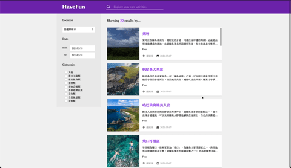

This project was bootstrapped with [Create React App](https://github.com/facebook/create-react-app) and TypeScript template.

# Dcard Toursim
A webapp that list different tourist attractions with filter tool. 



## Installation

```shell
$ git clone https://github.com/ChaoTzuJung/dcard-toursim.git
$ cd dcard-toursim
$ npm install && npm start (or using yarn instead)
```

## Features:
  - [X] Virtualized List
  - [X] Infinite Scroll
  - [X] Lazy Load
  - [X] Performance

### Virtualized List
Use `react-window` to achieve virtualized list which is a react components for efficiently rendering large lists and tabular data.

### Infinite Scroll && Lazy Loading
Use `IntersectionObserver` API to achieve infinite scroll and only load more data while scrolling to current bottom boundary.

### Performance
In addition to lazy-loading data, dcard-tourism also use react core functions to enhance app performance, such as `React.memo`、`useCallback`、`useMemo`...etc.

## File Structure
- Creating path aliases in create-react-app with `tsconfig.json` setting.
- Organize types definitions in `types` folder.
- Smarter way to organize **import** statements using `index.ts` files
- Export **S** object from `styled.ts` to resolve naming convention issue with React component and styled component.
```
src
├── api
│   └── proxy.ts
├── api
│   └── index.ts
├── hook
│   └── useFetchPost.tsx
│   └── useOnClickOutside.tsx
├── pages
│   └── Home
├── components
│   └── Calendar
│   └── CardItem
│   └── CardList
│   └── Checkbox
│   └── Filter
├── types
│   └── index.ts
├── utils
│   └── helper.ts
│   └── media.ts
└── App.tsx
└── GlobalStyles.ts
└── index.tsx
└── serviceWorker.ts
```

## Todo Roadmap
  - [ ] Content Page
  - [ ] Pagination
  - [ ] Search Bar
  - [ ] Calendar & Checkbox Filter
  - [ ] Error Handling
  - [ ] Storybook
  - [ ] Unit Test
  - [ ] Server Side Rendering

Netlify URL: [https://dcard-tourism.netlify.app](https://dcard-tourism.netlify.app)
